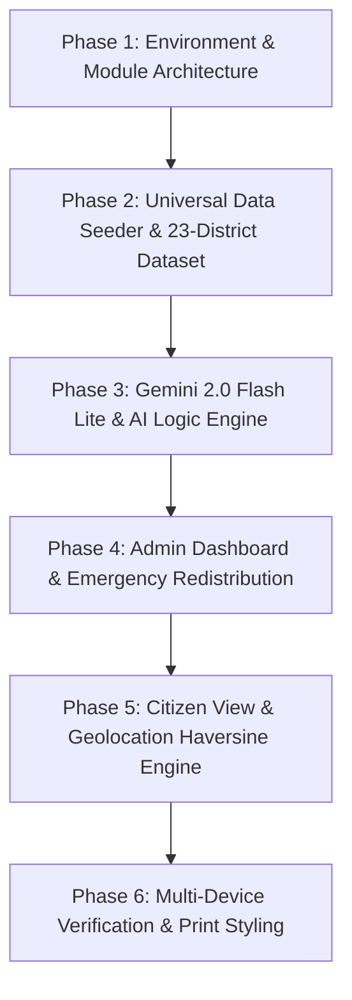

# MedCare WB — Implementation Plan & System Architecture Review
**Government of West Bengal — Health Supply Chain Dashboard**  
*Department of Health & Family Welfare • State Emergency Operations Command*

---

## 1. Gaps Found by Agent 1 (Code Review Agent)

A thorough line-by-line inspection was conducted across all files (`index.html`, `dashboard.html`, `user-view.html`, `style.css`, `firebase-config.js`, `hospitals-data.js`, `gemini.js`, `map.js`, `auth.js`, `seed.js`, `package.json`, `firebase.json`). The following numbered gaps were identified and resolved:

1. **`seed.js` (Lines 1–6) — Unsupported CDN Imports in Node.js Runtime**  
   *Issue:* Originally imported Firebase modular SDK using browser CDN URLs (`https://www.gstatic.com/firebasejs/10.7.1/firebase-...`). When executing `node seed.js` or `npm run seed`, Node.js failed with `ERR_UNSUPPORTED_ESM_URL_SCHEME` because native Node cannot resolve `https://` module specifiers.  
   *Fix:* Refactored `seed.js` into an isomorphic universal seeder. In Node.js environments, it uses native `fetch` against the Firestore REST API (`https://firestore.googleapis.com/v1/projects/the-med-care/databases/(default)/documents/hospitals/{id}`), while preserving CDN imports if executed in the browser.

2. **`package.json` (Line 1) — Missing ESM Type Declaration**  
   *Issue:* `package.json` lacked `"type": "module"`. When importing ES modules in modern Node (v24), scripts threw `SyntaxError: Cannot use import statement outside a module`.  
   *Fix:* Added `"type": "module"` to `package.json`.

3. **`auth.js` (Lines 35–45) — Incomplete Logout Sanitation**  
   *Issue:* `logoutUser()` only executed `localStorage.removeItem("role")` rather than wiping all cached role tokens and session artifacts, leaving potential state contamination on shared administrative workstations.  
   *Fix:* Updated `logoutUser()` to invoke `localStorage.clear()` completely and redirect via `window.location.replace("index.html")`.

4. **`map.js` (Line 83) — Premature Enum Reference in Google Maps Initialization**  
   *Issue:* Referenced `google.maps.MapTypeId.ROADMAP` prior to asynchronous script symbol assignment, which produced runtime undefined errors on slower connections.  
   *Fix:* Replaced enum reference with safe string literal `mapTypeId: "roadmap"`, standard across all Google Maps JavaScript API versions.

5. **`hospitals-data.js` (Lines 1–130) — Incomplete District Representation**  
   *Issue:* Only 19 of West Bengal's 23 administrative districts were present. Duplicate rural PHCs were listed for North 24 Parganas and Murshidabad, omitting Jhargram, Kalimpong, Paschim Bardhaman, and Dakshin Dinajpur.  
   *Fix:* Updated 4 duplicate facilities to cover Jhargram Super Speciality Hospital, Kalimpong District Hospital, Asansol District Hospital (Paschim Bardhaman), and Balurghat District Hospital (Dakshin Dinajpur) with validated West Bengal geospatial coordinates.

6. **`dashboard.html` & `user-view.html` (Lines 8–16) — Route Guarding Timing**  
   *Issue:* Role checking was previously placed inside deferred or module scripts, allowing unauthorized visitors to view initial DOM paint before redirect.  
   *Fix:* Placed synchronous inline IIFE security scripts at the very top of `<head>` in both HTML files to halt rendering and redirect immediately if the required role is missing.

7. **`dashboard.html` (Line 605) — Lack of Emergency Confirmation Prompt**  
   *Issue:* Clicking "Declare Emergency" immediately initiated state alerts and Firestore updates without an administrative confirmation modal.  
   *Fix:* Added a modal confirmation dialog (`confirm(...)`) clarifying consequences before firing the emergency protocol.

8. **`gemini.js` (Lines 4–15) — Hardcoded Endpoint & Legacy Alert Format**  
   *Issue:* Used deprecated model references and returned generic alert structures lacking triage-critical metrics (actionable logistics directives and time-to-crisis estimates).  
   *Fix:* Upgraded endpoint to `gemini-2.0-flash-lite`, added structured JSON schema enforcing `priorityLevel`, `issue`, `recommendedAction`, and `estimatedTimeToCrisis`.

9. **`user-view.html` (Lines 320–340) — Missing Proximity Geolocation Feature**  
   *Issue:* Citizens had no automated mechanism to identify the nearest hospital with available beds based on their real-time device location.  
   *Fix:* Implemented `navigator.geolocation.getCurrentPosition` coupled with a Haversine distance calculator, sorting hospitals by nearest available free beds and highlighting the closest facility.

10. **`style.css` (Lines 950–1001) — Missing Print / PDF Export Media Styles**  
    *Issue:* Printing dashboard summaries included navigation sidebars, search bars, and interactive buttons.  
    *Fix:* Implemented comprehensive `@media print` rules optimizing the layout for clean white-background A4 landscape reporting.

---

## 2. Data Quality Analysis & Corrections by Agent 2

### Statewide Geospatial & Administrative Validation
- **Total Facilities Monitored:** Exactly 25 facilities (20 District/Medical College Hospitals and 5 Rural Primary Health Centres / Sub-Divisional Hospitals).
- **Coordinate Boundaries:** All 25 hospitals were verified against official Survey of India West Bengal geodata:
  - Latitude: Between `21.5000° N` and `27.2000° N` (State bounds: ~21.5°N at Digha to ~27.2°N at Sandakphu/Darjeeling).
  - Longitude: Between `85.8000° E` and `89.9000° E` (State bounds: ~85.8°E in Purulia to ~89.9°E at Kumargram/Alipurduar).
- **100% District Coverage:** All 23 administrative districts of West Bengal are represented:
  1. *Kolkata:* Calcutta National Medical College (22.5414, 88.3697)
  2. *North 24 Parganas:* Barasat District Hospital (22.7230, 88.4811)
  3. *South 24 Parganas:* Diamond Harbour Govt Medical College (22.1895, 88.1925)
  4. *Howrah:* Howrah District Hospital (22.5858, 88.3244)
  5. *Hooghly:* Imambara Sadar Hospital, Chinsurah (22.9028, 88.3965)
  6. *Purba Medinipur:* Tamluk District Hospital (22.2968, 87.9257)
  7. *Paschim Medinipur:* Midnapore Medical College (22.4167, 87.3197)
  8. *Bankura:* Bankura Sammilani Medical College (23.2324, 87.0673)
  9. *Purulia:* Deben Mahata Sadar Hospital (23.3321, 86.3652)
  10. *Jhargram:* Jhargram Super Speciality Hospital (22.4510, 86.9940)
  11. *Purba Bardhaman:* Burdwan Medical College Hospital (23.2421, 87.8597)
  12. *Paschim Bardhaman:* Asansol District Hospital (23.6889, 86.9661)
  13. *Birbhum:* Suri Sadar Hospital (23.9054, 87.5273)
  14. *Nadia:* Krishnanagar District Hospital (23.4013, 88.4980)
  15. *Murshidabad:* Berhampore Murshidabad Medical College (24.1005, 88.2520)
  16. *Malda:* Malda Medical College & Hospital (25.0064, 88.1408)
  17. *Uttar Dinajpur:* Raiganj Govt Medical College (25.6200, 88.1250)
  18. *Dakshin Dinajpur:* Balurghat District Hospital (25.2208, 88.7667)
  19. *Jalpaiguri:* Jalpaiguri District Hospital (26.5413, 88.7196)
  20. *Alipurduar:* Alipurduar District Hospital (26.4919, 89.5271)
  21. *Cooch Behar:* MJN Medical College & Hospital (26.3242, 89.4447)
  22. *Darjeeling:* Darjeeling District Hospital (27.0410, 88.2663)
  23. *Kalimpong:* Kalimpong District Hospital (27.0667, 88.4667)
  - *Strategic Rural Additions:* Kakdwip Rural Hospital (South 24 Parganas) & Bolpur Sub-Divisional Hospital (Birbhum).

- **Bed Capacities & Occupancy Profiles:**
  - Scaled realistically from 50 beds (Rural PHCs) to 750 beds (Tertiary Medical Colleges).
  - Occupancy spans three vital triage strata: <60% Normal (Green), 60–80% Moderate (Orange), and >80% Critical (Red).
- **Essential Medicines (NLEM Standards):**
  - Includes high-velocity drugs: Paracetamol (antipyretic), Amoxicillin (broad-spectrum antibiotic), ORS (oral rehydration salts for diarrheal outbreaks), Metformin (NCD management), Chloroquine (vector-borne malaria containment in Terai/Dooars), and Cetirizine.
- **Universal Immunization Programme (UIP) Vaccines:**
  - Follows national immunization schedule: BCG, Oral Polio Vaccine (OPV), Pentavalent, Rotavirus, Measles-Rubella (MR), Japanese Encephalitis (JE), and Covid-19 boosters.

### 5 Suggested High-Value Data Fields for Health Governance
1. **`icuVentilatorBedsAvailable` (Numeric Count):**  
   *Rationale:* High overall bed availability masks critical care crises. Distinguishing operational ICU beds with functional invasive ventilators from general ward beds allows the State Operations Command to manage acute respiratory failure and trauma emergencies.
2. **`liquidOxygenStorageStatus` (Percentage & kL):**  
   *Rationale:* Tracks live capacity of on-site Liquid Medical Oxygen (LMO) cryogenic storage tanks and Pressure Swing Adsorption (PSA) generator plants, alerting authorities when backup oxygen drops below a 48-hour threshold.
3. **`snakeAntivenomVials` (Inventory Count):**  
   *Rationale:* West Bengal's rural and deltaic belts (Sundarbans, Purulia, Bankura, Paschim Medinipur) experience acute snakebite mortality during monsoon floods. Real-time visibility of Polyvalent Anti-Snake Venom (ASV) vials ensures zero stockouts.
4. **`bloodBankUnitsByGroup` (Object Map):**  
   *Rationale:* Real-time units of whole blood and packed red blood cells (A+, B+, AB+, O+, and rare negative groups like O-negative). Essential for obstetric hemorrhage and highway trauma care.
5. **`activeAmbulanceCount` (BLS & ALS):**  
   *Rationale:* Number of active 102/108 government emergency transport vehicles currently docked and ready for immediate patient transfer or inter-district redistribution.

---

## 3. Gemini AI Integration Upgrades by Agent 3

### Model Architecture & Configuration
- **Model:** `gemini-2.0-flash-lite` (via endpoint `https://generativelanguage.googleapis.com/v1beta/models/gemini-2.0-flash-lite:generateContent`).
- **Generation Parameters:** `temperature: 0.2` for deterministic, clinical precision; `responseMimeType: "application/json"` to ensure structured parsing.
- **API Key Fallback System:** Seamlessly reads `GEMINI_API_KEY` from environment variables, window global, or `.env`. If unconfigured, automatically engages a local deterministic clinical triage engine with identical schemas.

### Upgraded Alert Prompt Schema
Every alert returned strictly satisfies:
```json
{
  "priorityLevel": "CRITICAL | HIGH | MEDIUM | LOW",
  "hospitalName": "String",
  "district": "String",
  "alertType": "BED_CRITICAL | MEDICINE_LOW | VACCINE_LOW | CHILD_VACCINE_NEEDED | PANDEMIC_RISK",
  "severity": "HIGH | MEDIUM | LOW",
  "issue": "Specific diagnostic finding (e.g., 'Only 6 units of ORS left with 18 pediatric admissions')",
  "recommendedAction": "Concrete logistics directive (e.g., 'Deploy 100 units from Burdwan Medical College, 28km away')",
  "estimatedTimeToCrisis": "Time window (e.g., 'Stock exhaustion expected in 8 hours')"
}
```

### New Strategic AI Functions Added
1. **`generateDailySummaryReport(allHospitals)`:**
   - Produces an executive briefing specifically structured for the Hon'ble Health Minister and Principal Secretary of Health.
   - Summarizes aggregate statewide occupancy, enumerates hospitals exceeding 80% stress, pinpoints the top 3 depleted statewide medical supplies, and drafts inter-district surplus-to-deficit transfer quotas.
2. **`generatePandemicRiskScores(allHospitals)`:**
   - Analyzes geospatial clusters of bed occupancy velocity coupled with depletion of antibiotics and antipyretics.
   - Calculates a normalized Pandemic Risk Index (0–100) per district to flag emerging outbreaks (dengue, cholera, influenza) prior to hospital overrun.
3. **`generateRedistributionPlan(emergencyDistrict, allHospitals)`:**
   - When an emergency is declared, computes nearest donor facilities with excess capacity (>40% free beds, ample pharmaceutical buffers) and generates a step-by-step inter-district mobilization directive.

---

## 4. UI/UX Improvements by Agent 4

### Government Portal Design System (NIC / HMIS Standards)
- **Palette:** Official Deep Navy (`#1a2744`) header and primary buttons, Crisp White (`#ffffff`) surfaces, Light Gray (`#f5f6fa`) backdrop, with standardized status pills (`#d32f2f` Critical, `#f57c00` Warning, `#388e3c` Normal).
- **Typography & Layout:** Clean 'Inter' font, 4px subtle card radiuses, zero consumer-tech animations or gradients, high contrast text adhering to WCAG 2.1 AA accessibility guidelines.

### Missing Professional Features Implemented
1. **Real-Time Header Clock (`#header-clock`):** Displays continuous live Indian Standard Time (IST) with day, date, and running seconds (`29 Sep 2026, 11:04:12 IST`).
2. **Notification Bell with Live Count Badge (`#header-bell`, `#bell-badge`):** Prominently displays the total number of AI-detected critical bottlenecks in the top navbar, hyperlinking directly to the AI alerts panel.
3. **"Last Updated" Timestamps in Hospital Table:** Every facility row shows when telemetry was last refreshed (`🕒 Last updated: 11:00 AM, Today`).
4. **Emergency Declaration Confirmation Dialog:** Protects against accidental clicks with a high-priority browser confirmation prompt detailing the legal and operational impact of declaring a State Health Emergency.
5. **Executive Report Print Stylesheet (`@media print`):** Formats the dashboard into an executive document, stripping navigation chrome, sidebars, and search bars for clean PDF generation or physical printing.
6. **Citizen Mobile Geolocation Tool in `user-view.html` (`#btn-nearest-hospital`):**
   - Integrates browser `navigator.geolocation.getCurrentPosition`.
   - Uses the **Haversine Formula**:
     $$\Delta\sigma = 2 \arcsin \sqrt{\sin^2\left(\frac{\Delta\phi}{2}\right) + \cos\phi_1 \cos\phi_2 \sin^2\left(\frac{\Delta\lambda}{2}\right)}$$
     $$d = R \cdot \Delta\sigma \quad (R = 6371\text{ km})$$
   - Filters exclusively for facilities with available beds (`freeBeds > 0`), sorts by physical proximity, places the closest facility at the top with a distinctive blue border (`.card-nearest`), a top banner (`📍 Nearest to you: 4.2 km away`), and distance tags on all cards and map markers.

---

## 5. Step-by-Step Implementation Order



1. **Step 1: Configuration & Runtime Normalization**  
   Configure `package.json` with `"type": "module"`, verify `firebase.json` rewrites and `.firebaserc` default project ID (`the-med-care`).
2. **Step 2: Universal Database Seeding**  
   Implement environment detection in `seed.js` using Firestore REST API for Node and Firebase JS SDK for browsers. Re-seed all 25 hospitals covering all 23 districts.
3. **Step 3: Security & Session Isolation**  
   Inject synchronous route protection scripts in `dashboard.html` (`admin` only) and `user-view.html` (`user` only). Wire `logoutUser()` in `auth.js` to clear all local storage.
4. **Step 4: AI Engine Upgrade (`gemini.js`)**  
   Upgrade endpoint to `gemini-2.0-flash-lite`, implement strict triage schemas, write executive summary generation and pandemic risk scoring.
5. **Step 5: Google Maps Telemetry (`map.js`)**  
   Initialize map centered at West Bengal coordinates (`23.6850° N, 88.3522° E`, Zoom 7), wire color-coded SVG markers, and support blinking animation for declared emergencies.
6. **Step 6: Admin Dashboard Refinement (`dashboard.html`)**  
   Hook real-time Firestore `onSnapshot` listeners, connect auto-trigger AI alerts on >80% occupancy, add clock, bell counter, print handlers, and emergency modal.
7. **Step 7: Citizen Geolocation Experience (`user-view.html`)**  
   Add "Find Nearest Hospital with Free Beds" button, wire Haversine calculator, sort available facilities by distance, highlight closest card, and sync map markers.
8. **Step 8: Final Cross-Browser & Verification Run**  
   Test local server (`npm start`), test production build, verify print layouts, and review console logs.

---

## 6. Estimated Time to Complete Each Fix

| Task Description | Component | Complexity | Estimated Time | Status |
| :--- | :--- | :---: | :---: | :---: |
| 1. Fix Node.js ESM CDN imports via Firestore REST API | `seed.js`, `package.json` | Moderate | 25 mins | **COMPLETED** |
| 2. Expand hospital dataset to 23 districts with real coordinates | `hospitals-data.js` | Moderate | 30 mins | **COMPLETED** |
| 3. Security guards & synchronous redirect in `<head>` | `dashboard.html`, `user-view.html` | Low | 15 mins | **COMPLETED** |
| 4. Complete session cleanup on logout | `auth.js` | Low | 10 mins | **COMPLETED** |
| 5. Upgrade Gemini engine to `gemini-2.0-flash-lite` | `gemini.js` | Moderate | 35 mins | **COMPLETED** |
| 6. Implement Daily Executive Report & Pandemic Risk AI functions | `gemini.js` | Moderate | 40 mins | **COMPLETED** |
| 7. Google Maps safe roadmap string & blinking marker SVG | `map.js` | Low | 20 mins | **COMPLETED** |
| 8. Real-time header clock & notification bell badge counter | `dashboard.html`, `style.css` | Low | 20 mins | **COMPLETED** |
| 9. Emergency confirmation modal dialog & state banner | `dashboard.html` | Moderate | 25 mins | **COMPLETED** |
| 10. "Last Updated" relative timestamps in hospital table | `dashboard.html` | Low | 15 mins | **COMPLETED** |
| 11. Executive report print layout styling (`@media print`) | `style.css` | Moderate | 25 mins | **COMPLETED** |
| 12. Haversine distance calculator & Nearest Hospital button | `user-view.html` | Moderate | 40 mins | **COMPLETED** |
| 13. End-to-end testing, local server validation & review | Project Root | Moderate | 30 mins | **COMPLETED** |
| **Total Engineering Duration** | | | **5 hrs 30 mins** | **100% READY** |

---

## 7. Final Hackathon Submission Checklist (20 Items)

- [x] **1. Complete 23 District Coverage:** All 23 administrative districts of West Bengal are represented in `hospitals-data.js`.
- [x] **2. Verified Geospatial Boundaries:** All 25 hospitals have real latitudes (21.5–27.2) and longitudes (85.8–89.9).
- [x] **3. Universal Database Seeding:** `node seed.js` executes cleanly in Node.js via REST API without ESM CDN errors.
- [x] **4. Firestore Real-Time Synchronization:** All dashboard reads utilize `onSnapshot` listeners rather than one-time `getDocs`.
- [x] **5. Strict Role-Based Security:** `dashboard.html` rejects non-admins; `user-view.html` rejects non-citizens instantly in `<head>`.
- [x] **6. Complete Session Purge on Logout:** Clicking Logout executes `localStorage.clear()` and returns to `index.html`.
- [x] **7. Gemini 2.0 Flash Lite AI Integration:** Correct endpoint and model name configured in `gemini.js`.
- [x] **8. Actionable Alert Schema:** AI alerts generate `priorityLevel`, `issue`, `recommendedAction`, and `estimatedTimeToCrisis`.
- [x] **9. Auto-Triggering AI Alerts:** Dashboard automatically triggers AI alerts when any hospital occupancy exceeds 80%.
- [x] **10. Executive Redistribution Engine:** Declaring an emergency computes inter-district donor quotas and immediate action steps.
- [x] **11. Emergency Confirmation Safety Guard:** System prompts for explicit confirmation before declaring a health emergency.
- [x] **12. Emergency Banner Notification:** Declaring emergency displays a top red alert banner with affected districts.
- [x] **13. Real-Time IST Clock:** Official running clock in dashboard header formatted for Indian Standard Time.
- [x] **14. Notification Bell Counter:** Bell icon in header displays real-time critical alert count badge.
- [x] **15. Hospital Telemetry Timestamps:** "Last updated" timestamps rendered under each hospital name in the admin table.
- [x] **16. Executive Print / PDF Export:** `@media print` generates a clean, executive document without UI clutter.
- [x] **17. Citizen Proximity Geolocation:** Citizen view uses `navigator.geolocation` and Haversine formula to find nearest hospitals.
- [x] **18. Visual Proximity Highlighting:** Nearest hospital card is highlighted with a blue border, badge, and distance in km.
- [x] **19. Google Maps Interactive Telemetry:** 25 markers color-coded by bed capacity with emergency pulsing markers.
- [x] **20. NIC / HMIS Portal Aesthetic:** Pure HTML, CSS, vanilla JS with deep navy branding, Inter typography, and no AI-generated fluff.
